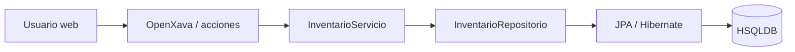

# Arquitectura

La aplicacion sigue una separacion en cuatro responsabilidades:

1. Presentacion: OpenXava genera formularios, listas, filtros y CRUD a partir de las entidades y `@View`.
2. Aplicacion: `ProcesarCompra` y `ProcesarVenta` coordinan la accion del usuario y la transaccion.
3. Dominio: las entidades, embebibles e `InventarioServicio` contienen calculos y reglas de stock.
4. Infraestructura: JPA/Hibernate, `JpaInventarioRepositorio`, HSQLDB y Tomcat 9.

La inversion de dependencia entre servicio y repositorio permite probar las reglas con Mockito. Las compras y ventas solo cambian stock al usar la accion Procesar y quedan marcadas para evitar doble aplicacion.
